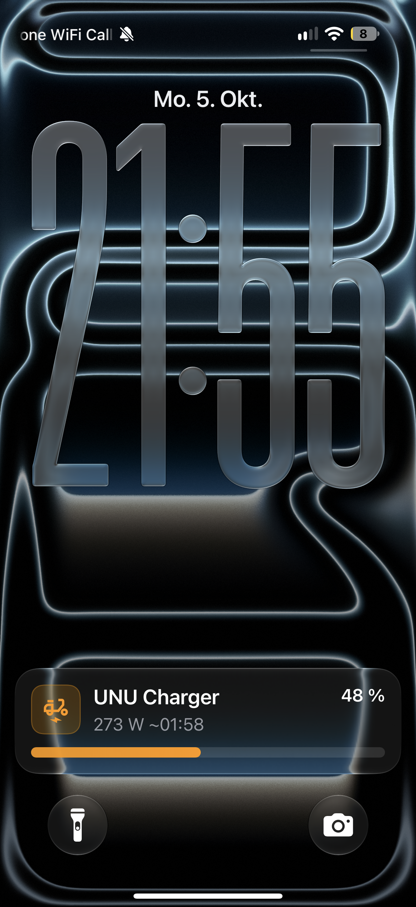

# unu Charge Monitor 🛵🔋

Live-Ladeanzeige für den **unu-Akku** in Home Assistant – ohne smartes Ladegerät.
Das Original-Ladegerät hängt an einer **smarten Steckdose mit Leistungsmessung**; aus der
immer gleichen Ladekurve schätzt das Package Ladestand und Restzeit und zeigt beides als
**Live Activity** (iOS) bzw. **Live Update** (Android) auf dem Sperrbildschirm.

> 🇬🇧 *Home Assistant package that turns a dumb unu battery charger on a smart plug into a live
> charging display (state of charge, ETA, iOS Live Activity / Android Live Update), based on a
> measured charging curve. Comments and notifications are in German.*

<p align="center">
  
</p>

## Funktionen

- **Ladestand & Restzeit** aus einer gemessenen Ladekurve des Original-Ladegeräts
- **Startladestand wird automatisch erkannt** (4 min nach Ladebeginn aus der Ladeleistung)
- **Live Activity / Live Update** mit Prozent, Fortschrittsbalken, Leistung und Fertig-Uhrzeit
- **Push-Nachricht** bei „voll“ oder „abgebrochen“ (z. B. Akku zu früh abgezogen)
- **Steckdose schaltet 15 min nach Ladeende ab** (spart die Erhaltungsleistung)
- **Ladeprotokoll** unter „Aktivität“: geladene Wh, Startwert, Spitzenleistung, hochgerechnete Vollladung
- Live Activity per Schalter ein-/ausschaltbar
- Robust gegen Neustarts, kurze Steckdosen-Aussetzer und Neuladen der Konfiguration

## Voraussetzungen

- Home Assistant **2026.7** oder neuer
- Smarte Steckdose mit **Leistung (W)** und **Energiezähler (kWh)**
- Companion-App mit Live-Activity-/Live-Update-Unterstützung
  (iOS 17.2+ mit App 2026.9+, bzw. Android 16+)
- Für das Dashboard (optional): [Mushroom](https://github.com/piitaya/lovelace-mushroom) über HACS

## Installation

**1. Packages aktivieren** (einmalig) – in `configuration.yaml`:

```yaml
homeassistant:
  packages: !include_dir_named packages
```

Gibt es schon einen `homeassistant:`-Block, nur die `packages`-Zeile darunter einrücken.

**2. Datei ablegen:** `packages/unu_laden.yaml` nach `/config/packages/unu_laden.yaml` kopieren.

**3. Anpassen** (im File editor mit Suchen & Ersetzen):

| Suchen | Ersetzen durch |
|---|---|
| `mobile_app_DEIN_HANDY` | deinen Notify-Dienst, z. B. `mobile_app_max_iphone` (zu finden unter Entwicklerwerkzeuge → Aktionen → `notify.mobile_app…`) |
| `unu_charger` | nur nötig, wenn deine Steckdose anders heißt |

**Tipp:** Am einfachsten benennst du deine Steckdose in HA in `unu_charger` um. Dann heißen die
Entitäten `switch.unu_charger`, `sensor.unu_charger_power` und `sensor.unu_charger_energy`,
und du musst nur den Notify-Dienst ersetzen.

**4. Laden:** Entwicklerwerkzeuge → YAML → „Konfiguration prüfen“, dann HA **neu starten**.

**5. Live Activity einschalten:** Der Schalter `input_boolean.unu_live_activity` startet beim
ersten Mal auf „aus“ – einmal einschalten, danach merkt HA sich den Zustand.

## Benutzung

Steckdose an, Akku anstecken – fertig. Nach ~30 s erscheint die Live Activity, nach 4 min ist
der Startladestand geschätzt. Bei Bedarf lässt er sich unter „unu Ladestand bei Ladestart“
von Hand korrigieren.

Am Ende verschwindet die Live Activity, eine Push-Nachricht kommt, und 15 min später geht die
Steckdose aus. **Vor der nächsten Ladung die Steckdose wieder einschalten.**

## Dashboard

`dashboard/ladegeraet_section.yaml` ist ein fertiger Abschnitt für ein Sections-Dashboard:
Dashboard bearbeiten → Abschnitt hinzufügen → ⋮ → „In YAML bearbeiten“ → Inhalt einfügen.

## Kalibrierung

Die Werte im Package stammen aus zwei Messladungen mit dem **Original-Ladegerät** und zwei
unu-Akkus (1778 Wh Nennkapazität):

| Wert | Messung |
|---|---|
| Spitzenleistung | ~303 W |
| Knick (Beginn Abfallphase) | ~91 % |
| Dauer Abfallphase | ~71 min |
| Abschalten | ~35 W, danach ~4 W |
| Vollladung ab Steckdose | ~1875 Wh |

Mit derselben Kombination sollte alles direkt passen. Nach jeder Ladung steht unter
**„Aktivität“** eine Zeile mit der hochgerechneten Vollladung – weicht sie bei dir deutlich ab,
trägst du deinen Wert im Package im Abschnitt **„Kalibrierung“** (unter `template:`) ein.

Für **andere Ladegeräte oder Akkus** müssen auch die Tabellen neu gemessen werden: eine
Ladung möglichst ab leerem Akku durchlaufen lassen, unter „Verlauf“ den Leistungs- und
Energiesensor als CSV exportieren und die Tabellen daraus ableiten.

## Fehlerbehebung

**Nur normale Mitteilungen statt Live Activity:** App-, HA- und iOS-Version prüfen;
in den iOS-Einstellungen → Home Assistant → Live-Aktivitäten erlauben; App einmal neu öffnen.

**Ende wird nicht erkannt:** Zieht dein Ladegerät nach dem Vollladen mehr als 12 W, die
Schwelle `below: 12` beim Trigger `id: ende` erhöhen.

**Ladestand springt nach dem Neuladen der Konfiguration:** Statt „Alle YAML-Konfigurationen“
nur „Template-Entitäten“ bzw. „Automationen“ neu laden.

## Lizenz

MIT – siehe [LICENSE](LICENSE). Keine Gewähr; das Package schaltet eine Steckdose.
