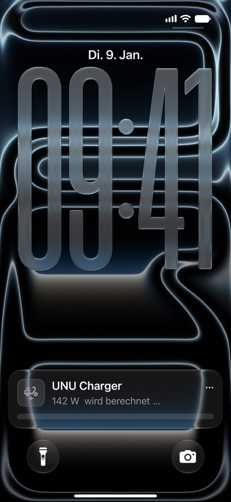
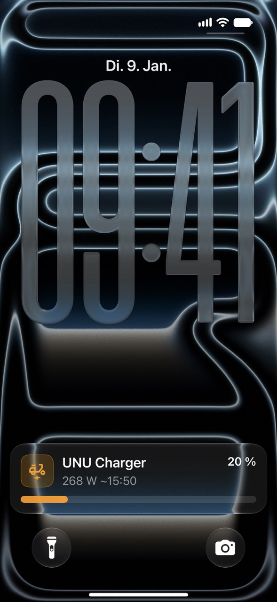
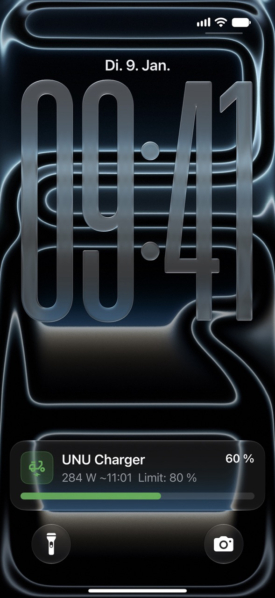
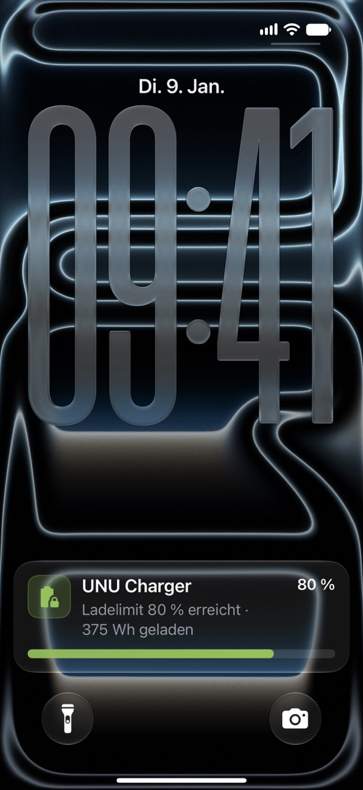
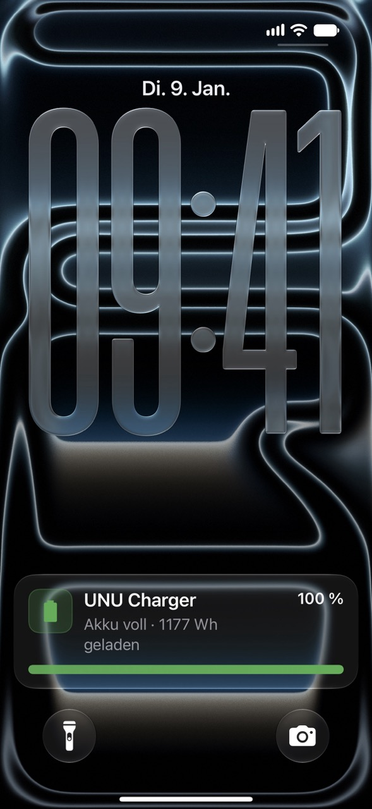
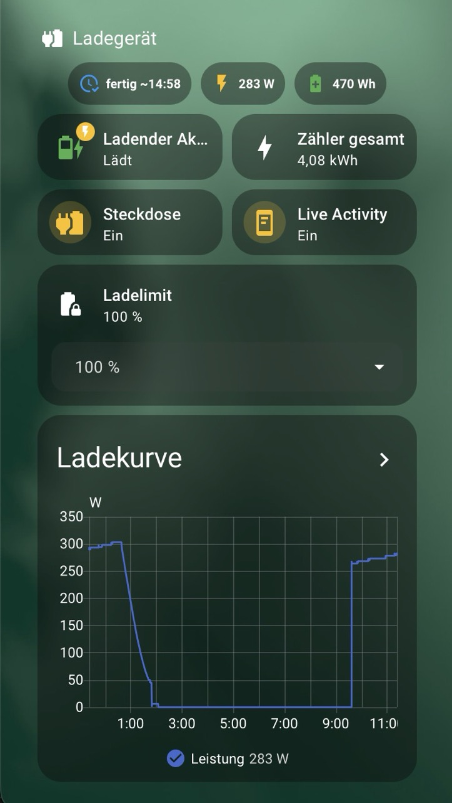

<h1 align="center">unu Charger Monitor 🛵🔋</h1>

<p align="center">
  <b>Live-Ladeanzeige für den unu-Akku in Home Assistant – ohne smartes Ladegerät.</b><br>
  Ladestand, Fertig-Uhrzeit und Ladelimit als Live Activity auf dem iPhone (bzw. Live Update auf Android).
</p>

<p align="center">
  
  
  
  
  
</p>

<table align="center">
  <tr>
    <td align="center"><br><sub><b>Anlauf</b><br>wird berechnet …</sub></td>
    <td align="center"><br><sub><b>20 %</b><br>Leistung &amp; Fertig-Uhrzeit</sub></td>
    <td align="center"><br><sub><b>60 %</b><br>mit Ladelimit 80 %</sub></td>
    <td align="center"><br><sub><b>Limit erreicht*</b><br>80 %</sub></td>
    <td align="center"><br><sub><b>Voll*</b><br>100 %</sub></td>
  </tr>
</table>

<p align="center"><sub>* Darstellung des Endzustands. Im Betrieb verschwindet die Live Activity am Ende und es kommt stattdessen eine Push-Nachricht.</sub></p>

> 🇬🇧 *Home Assistant package that turns a dumb unu battery charger on a smart plug into a live
> charging display (state of charge, ETA, charge limit, iOS Live Activity / Android Live Update),
> based on a measured charging curve. Comments and notifications are in German.*

## So funktioniert's

Das Original-Ladegerät hängt an einer **smarten Steckdose mit Leistungsmessung**. Weil ein
Li-Ion-Akku immer gleich lädt, verrät die Leistung, wo er gerade steht:

- **Konstantstrom-Phase:** Die Leistung steigt langsam mit der Akkuspannung. Daraus wird beim
  Start der Ladestand geschätzt, danach zählt das Package die geladene Energie hoch.
- **Abfallphase** (ab ~91 %): Die Leistung sinkt über gut eine Stunde. Hier ergibt sich der
  Ladestand direkt aus der Leistung – die Anzeige korrigiert sich also selbst.

## Funktionen

- 🔋 **Ladestand & Restzeit** aus einer gemessenen Ladekurve des Original-Ladegeräts
- 🎯 **Startladestand wird automatisch erkannt**, sobald das Ladegerät nach dem sanften Anlauf stabil lädt
- 📱 **Live Activity / Live Update** mit Prozent, Fortschrittsbalken, Leistung und Fertig-Uhrzeit
- ⛔ **Ladelimit** (50–100 %) – Steckdose schaltet ab, sobald der Ladestand erreicht ist
- 🔔 **Push-Nachricht** bei „voll“, „Ladelimit erreicht“ oder „abgebrochen“
- 🔌 **Steckdose schaltet 15 min nach einer Vollladung ab** (spart die Erhaltungsleistung)
- 📒 **Ladeprotokoll** unter „Aktivität“: geladene Wh, Startwert, Spitzenleistung, hochgerechnete Vollladung
- 🛡️ Robust gegen Neustarts, kurze Steckdosen-Aussetzer und Neuladen der Konfiguration

## Voraussetzungen

- Home Assistant **2026.7** oder neuer
- Smarte Steckdose mit **Leistung (W)** und **Energiezähler (kWh)**
- Companion-App mit Live-Activity-/Live-Update-Unterstützung
  (iOS 17.2+ mit App 2026.9+, bzw. Android 16+; ältere Android-Versionen zeigen eine
  normale Mitteilung mit Fortschrittsbalken)
- Für das Dashboard (optional): [Mushroom](https://github.com/piitaya/lovelace-mushroom) über HACS

## Installation

**1. Packages aktivieren** (einmalig) – in `configuration.yaml`:

```yaml
homeassistant:
  packages: !include_dir_named packages
```

Gibt es schon einen `homeassistant:`-Block, nur die `packages`-Zeile mit zwei Leerzeichen
darunter einrücken.

**2. Datei ablegen:** `packages/unu_laden.yaml` nach `/homeassistant/packages/unu_laden.yaml`
kopieren (z. B. mit dem File-editor- oder Studio-Code-Server-Add-on; je nach Zugriff heißt der
Ordner auch `/config/packages/`). Den Ordner `packages` gegebenenfalls anlegen.

**3. Anpassen** (im Editor mit Suchen & Ersetzen):

| Suchen | Ersetzen durch |
|---|---|
| `mobile_app_DEIN_HANDY` | deinen Notify-Dienst, z. B. `mobile_app_max_iphone` (zu finden unter Entwicklerwerkzeuge → Aktionen → `notify.mobile_app…`) |
| `unu_charger` | nur nötig, wenn deine Steckdose anders heißt |

**Tipp:** Am einfachsten benennst du deine Steckdose in HA in `unu_charger` um. Dann heißen die
Entitäten `switch.unu_charger`, `sensor.unu_charger_power` und `sensor.unu_charger_energy`,
und du musst nur den Notify-Dienst ersetzen.

**4. Laden:** Entwicklerwerkzeuge → YAML → „Konfiguration prüfen“, dann HA **neu starten**.

**5. Live Activity einschalten:** Der Schalter `input_boolean.unu_live_activity` startet beim
ersten Mal auf „aus“ – einmal einschalten, danach merkt HA sich den Zustand.

## Benutzung

Steckdose an, Akku anstecken – fertig. Nach ~30 s erscheint die Live Activity mit
„wird berechnet …“. Das Ladegerät startet sanft und braucht ein paar Minuten bis zur vollen
Leistung; sobald sie stabil ist (meist nach 3–6 min), wird der Startladestand geschätzt und
Ladestand, Fertig-Uhrzeit und Fortschrittsbalken erscheinen. Bei Bedarf lässt sich der
Startwert unter „unu Ladestand bei Ladestart“ von Hand korrigieren.

**Ladelimit:** Unter „unu Ladelimit“ einen Wert wählen (100 % = kein Limit). Das Limit greift,
sobald der Startladestand ermittelt ist; danach schaltet die Steckdose ab, sobald der geschätzte
Ladestand erreicht ist (Genauigkeit etwa ±5–8 %). Ab und zu auf 100 % laden, damit das BMS
die Zellen am oberen Ende ausgleichen kann.

**Ende:** Die Live Activity verschwindet, eine Push-Nachricht kommt, und bei einer Vollladung
geht die Steckdose 15 min später aus. **Vor der nächsten Ladung die Steckdose wieder einschalten.**

## Dashboard

`dashboard/ladegeraet_section.yaml` ist ein fertiger Abschnitt für ein Sections-Dashboard:
Dashboard bearbeiten → Abschnitt hinzufügen → ⋮ → „In YAML bearbeiten“ → Inhalt einfügen.
   <p align="center">
     
   </p>

## Kalibrierung

Die Werte im Package stammen aus zwei Messladungen mit dem **Original-Ladegerät** und zwei
unu-Akkus (1778 Wh Nennkapazität):

| Wert | Messung |
|---|---|
| Spitzenleistung | ~303 W |
| Knick (Beginn Abfallphase) | ~91 % |
| Dauer Abfallphase | ~71 min |
| Abschalten | ~35 W, danach ~4 W |
| Vollladung ab Steckdose | ~1875 Wh |

Mit derselben Kombination sollte alles direkt passen. Nach jeder Ladung steht unter
**„Aktivität“** eine Zeile mit der hochgerechneten Vollladung – weicht sie bei dir deutlich ab,
trägst du deinen Wert im Package im Abschnitt **„Kalibrierung“** (unter `template:`) ein.

Für **andere Ladegeräte oder Akkus** müssen auch die Tabellen neu gemessen werden: eine
Ladung möglichst ab leerem Akku durchlaufen lassen, unter „Verlauf“ den Leistungs- und
Energiesensor als CSV exportieren und die Tabellen daraus ableiten. Messdaten von anderen
Ladegeräten sind als Issue oder Pull Request sehr willkommen!

## Fehlerbehebung

**Nur normale Mitteilungen statt Live Activity:** App-, HA- und iOS-Version prüfen;
in den iOS-Einstellungen → Home Assistant → Live-Aktivitäten erlauben; App einmal neu öffnen.
Auf Android: Benachrichtigungen für die HA-App erlauben und die Akku-Optimierung abschalten.

**Ende wird nicht erkannt:** Zieht dein Ladegerät nach dem Vollladen mehr als 12 W, die
Schwelle `below: 12` beim Trigger `id: ende` erhöhen.

**Ladestand springt nach dem Neuladen der Konfiguration:** Statt „Alle YAML-Konfigurationen“
nur „Template-Entitäten“ bzw. „Automationen“ neu laden.

## Lizenz

MIT – siehe [LICENSE](LICENSE). Keine Gewähr; das Package schaltet eine Steckdose.
